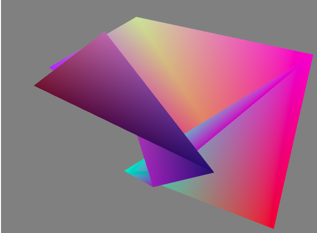

# Swarthmore WebGL Independent Study
## Michael Piazza

### This is a master repo to hold various different projects.

###1. Tutorial 1
This will generate randomly positioned triangles, with random interpolated colors at each vertex. The goal of this experiment was to learn the basics of shaders (passing in data as attributes and varyings), and using multiple buffers.

